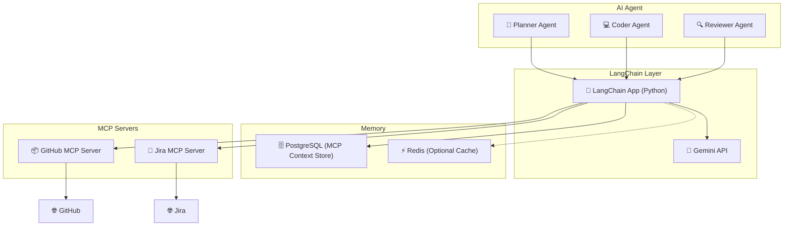

# mcp-agent

**Status**: Multi-agent system with MCP integration - orchestrating AI-powered development workflows across GitHub and Jira platforms.

## A Github/Jira MCP Agent 

```mermaid
graph TD
    subgraph AI Agent
        PlannerAgent["🧠 Planner Agent"]
        CoderAgent["💻 Coder Agent"]
        ReviewerAgent["🔍 Reviewer Agent"]
    end

    subgraph LangChain Layer
        LangChainApp["🧩 LangChain App (Python)"]
        GeminiAPI["🔮 Gemini API"]
    end

    subgraph Memory
        PG["🗄️ PostgreSQL (MCP Context Store)"]
        Redis["⚡ Redis (Optional Cache)"]
    end

    subgraph MCP Servers
        GitHubMCP["📦 GitHub MCP Server"]
        JiraMCP["📘 Jira MCP Server"]
    end

    PlannerAgent --> LangChainApp
    CoderAgent --> LangChainApp
    ReviewerAgent --> LangChainApp

    LangChainApp --> GeminiAPI
    LangChainApp --> PG
    LangChainApp -.-> Redis
    LangChainApp --> GitHubMCP
    LangChainApp --> JiraMCP

    GitHubMCP --> GitHub["🌐 GitHub"]
    JiraMCP --> Jira["🌐 Jira"]
```
